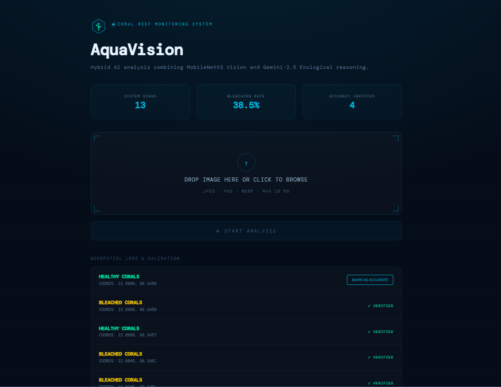
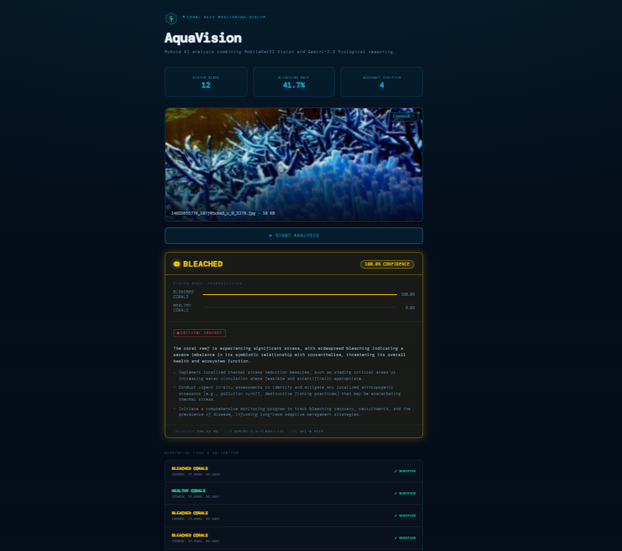
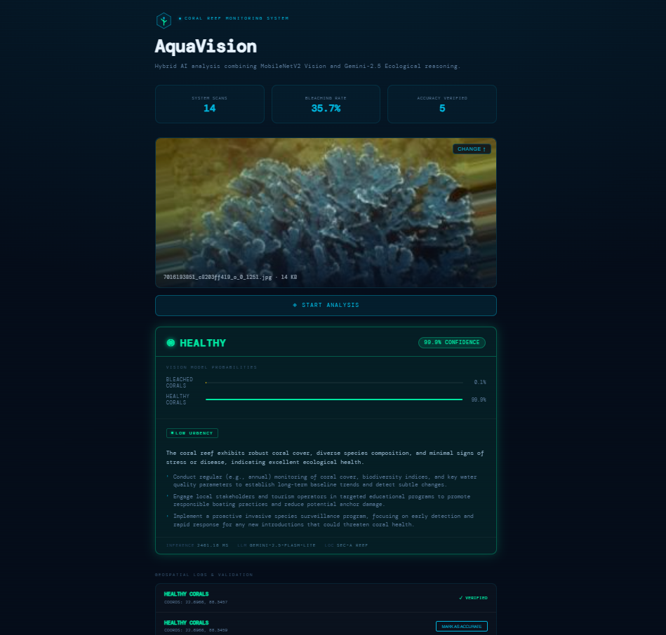

# AquaVision 🪸
### Coral Reef Health Monitoring System

> Hybrid AI pipeline combining a fine-tuned MobileNetV2 vision model with Gemini-2.5-Flash-Lite ecological reasoning — built for real-world reef monitoring.





## What It Does

AquaVision lets a researcher or diver upload a coral reef image and instantly receive:

- A **binary classification** — Healthy or Bleached — from a fine-tuned MobileNetV2 model
- **Per-class confidence probabilities** from the vision model
- **AI-generated ecological recommendations** from Gemini-2.5-Flash-Lite (urgency level + 3 expert actions)
- A **persistent log** of all scans with a human-in-the-loop verification workflow
- A live **analytics dashboard** showing total scans, bleaching rate, and verified count

---

## Architecture

```
┌─────────────────────────────────────────────────────┐
│                   React Frontend                    │
│  Upload → Analyse → Results + Scan History   │
└───────────────────────┬─────────────────────────────┘
                        │ HTTP (FormData + lat/lon)
                        ▼
┌─────────────────────────────────────────────────────┐
│              FastAPI Backend (Python)               │
│                                                     │
│  /predict       → TF model inference + Gemini call  │
│  /analytics     → Bleaching rate, scan counts       │
│  /history       → Last 10 records from DB           │
│  /verify/{id}   → Human validation loop (PATCH)     │
└──────────┬───────────────────────┬──────────────────┘
           │                       │
           ▼                       ▼
┌──────────────────┐   ┌───────────────────────────┐
│  TF/Keras Model  │   │  SQLite (coral_data.db)   │
│  MobileNetV2     │   │  Predictions + Labels │
│  .keras file     │   └───────────────────────────┘
└──────────────────┘
           │
           ▼
┌──────────────────────────────┐
│  Google Gemini 2.5-Flash-Lite │
│  Ecological recommendations  │
└──────────────────────────────┘
```

---

## Project Structure

```
aquavision/
│
│
├── backend/
│   ├── main.py                      # FastAPI app — all endpoints
|    ├── requirements.txt                  # Python dependencies
│   ├── coral_classification_final.keras  # Trained model 
│   ├── coral_data.db                # SQLite database (auto-created)
│   └── .env                         # API keys & config (not in git)
│
└── frontend/
    └── src/
        ├── App.jsx                  # Main UI — upload, analyse, results
        └── components/
            ├── Header.jsx
            ├── Footer.jsx
            └── CoralLogo.jsx
```

---

## Model Training

The model was trained on the [Corals Classification dataset](https://www.kaggle.com/datasets/aneeshdighe/corals-classification) from Kaggle.

**Pipeline (Jupyter Notebook):**

| Stage | Detail |
|---|---|
| Base model | MobileNetV2 (ImageNet weights, top removed) |
| Head | GlobalAveragePooling → BatchNorm → Dense(256) → Dropout(0.4) → Softmax(2) |
| Stage A | Head-only training, base frozen — 3 epochs, lr=1e-3 |
| Stage B | Fine-tune top 30 layers — 5 epochs, lr=1e-5 |
| Augmentation | Flip, rotation, zoom, brightness shift (3× augment per image) |
| Class weighting | `sklearn` balanced weights to handle class imbalance |
| Callbacks | EarlyStopping, ModelCheckpoint, ReduceLROnPlateau |

**Dataset split used from source:**

| Split | Healthy | Bleached |
|---|---|---|
| Train | 3,504 | 3,880 |
| Val | 500 | 485 |
| Test | 438 | 485 |

---

## Getting Started

### Prerequisites

- Python 3.10+
- React.js 18
- A [Google AI Studio](https://aistudio.google.com/) API key for Gemini

---

### 1. Train the Model (Jupyter Notebook)

Open a Jupyter notebook and run the two cells:

**Cell 1 — Download dataset:**
```python
import kagglehub, os
path = kagglehub.dataset_download("aneeshdighe/corals-classification")
KAGGLE_INPUT = path
```

**Cell 2 — Full training pipeline:**
```python
# ════════════════════════════════════════════════════════
# FULL PIPELINE — JUPYTER NOTEBOOK (Keras 3 compatible)
# ════════════════════════════════════════════════════════

import os, shutil, random
import numpy as np
import matplotlib.pyplot as plt
import tensorflow as tf
from tensorflow.keras.applications import MobileNetV2
from tensorflow.keras.layers import (GlobalAveragePooling2D, Dense, Dropout,
                                     BatchNormalization, RandomFlip,
                                     RandomRotation, RandomZoom,
                                     RandomBrightness, Rescaling)
from tensorflow.keras.models import Model
from tensorflow.keras.optimizers import Adam
from tensorflow.keras.callbacks import EarlyStopping, ModelCheckpoint, ReduceLROnPlateau
from sklearn.metrics import classification_report, confusion_matrix
from sklearn.utils.class_weight import compute_class_weight
from PIL import Image
import seaborn as sns

OUTPUT_DIR = "/content/coral_dataset"
MODEL_OUT  = "/content/coral_model.h5"

IMG_SIZE    = (224, 224)
BATCH_SIZE  = 32
N_AUGMENT   = 3
EPOCHS_HEAD = 10
EPOCHS_FINE = 20
LR_HEAD     = 1e-3
LR_FINE     = 1e-5
SEED        = 42
random.seed(SEED); np.random.seed(SEED); tf.random.set_seed(SEED)

# ════════════════════════════════════════════════════════
# STEP 1 — Locate pre-existing split folders
# ════════════════════════════════════════════════════════
SPLIT_MAP = {
    "training":   "train",
    "train":      "train",
    "validation": "val",
    "valid":      "val",
    "val":        "val",
    "testing":    "test",
    "test":       "test",
}

def find_split_root(dataset_path):
    for root, dirs, _ in os.walk(dataset_path):
        if {d.lower() for d in dirs} & set(SPLIT_MAP):
            return root
    raise RuntimeError(f"No Training/Validation/Testing folders found under {dataset_path}")

print("=" * 55)
print("STEP 1 — Locating pre-split folders in:", KAGGLE_INPUT)
print("=" * 55)

split_root = find_split_root(KAGGLE_INPUT)
print(f"  Split root: {split_root}")

source_data = {}
for entry in os.scandir(split_root):
    if not entry.is_dir():
        continue
    split_key = SPLIT_MAP.get(entry.name.lower())
    if split_key is None:
        continue
    split_dict = {}
    for cls_entry in os.scandir(entry.path):
        if not cls_entry.is_dir():
            continue
        imgs = [
            os.path.join(cls_entry.path, f)
            for f in os.listdir(cls_entry.path)
            if f.lower().endswith((".jpg", ".jpeg", ".png"))
        ]
        if imgs:
            split_dict[cls_entry.name.lower()] = imgs
    if split_dict:
        source_data.setdefault(split_key, {})
        for cls, paths in split_dict.items():
            source_data[split_key].setdefault(cls, []).extend(paths)

CLASSES     = sorted(set().union(*[set(d) for d in source_data.values()]))
NUM_CLASSES = len(CLASSES)
print(f"\n  Classes found: {CLASSES}")
for split, sd in source_data.items():
    for cls, paths in sd.items():
        print(f"  [{split:<5}] {cls:<25} {len(paths):>5} images")

if NUM_CLASSES < 2:
    raise RuntimeError("Need at least 2 classes.")

# ════════════════════════════════════════════════════════
# STEP 2 — Copy into OUTPUT_DIR/{train,val,test}/{class}
# ════════════════════════════════════════════════════════
print("\n" + "=" * 55)
print("STEP 2 — Copying to /content/coral_dataset/")
print("=" * 55)

if os.path.exists(OUTPUT_DIR):
    shutil.rmtree(OUTPUT_DIR)

for split, sd in source_data.items():
    for cls, paths in sd.items():
        dest = os.path.join(OUTPUT_DIR, split, cls)
        os.makedirs(dest, exist_ok=True)
        for i, src in enumerate(paths):
            ext = os.path.splitext(src)[1] or ".jpg"
            shutil.copy2(src, os.path.join(dest, f"{cls}_{split}_{i:05d}{ext}"))
        print(f"  [{split:<5}] {cls:<25} → {len(paths):>5} images copied")

# ════════════════════════════════════════════════════════
# STEP 3 — Augment training images
# ════════════════════════════════════════════════════════
print("\n" + "=" * 55)
print("STEP 3 — Augmenting training images")
print("=" * 55)

def augment_image(img):
    arr = np.array(img)
    if random.random() > 0.5:
        arr = arr[:, ::-1, :]
    f   = random.uniform(0.7, 1.3)
    arr = np.clip(arr.astype(np.float32) * f, 0, 255).astype(np.uint8)
    h, w   = arr.shape[:2]
    scale  = random.uniform(0.85, 1.0)
    nh, nw = int(h * scale), int(w * scale)
    t, l   = random.randint(0, h - nh), random.randint(0, w - nw)
    arr    = np.array(Image.fromarray(arr[t:t+nh, l:l+nw]).resize((w, h), Image.BILINEAR))
    out    = arr.astype(np.int16)
    for c in range(3):
        out[:, :, c] += random.randint(-20, 20)
    arr   = np.clip(out, 0, 255).astype(np.uint8)
    angle = random.uniform(-20, 20)
    return Image.fromarray(arr).rotate(angle, resample=Image.BILINEAR, fillcolor=(0, 0, 0))

for cls in CLASSES:
    folder = os.path.join(OUTPUT_DIR, "train", cls)
    if not os.path.isdir(folder):
        print(f"  WARNING: no train folder for {cls}, skipping")
        continue
    originals = [f for f in os.listdir(folder) if "_aug" not in f]
    for fname in originals:
        img  = Image.open(os.path.join(folder, fname)).convert("RGB").resize(IMG_SIZE)
        stem = os.path.splitext(fname)[0]
        for k in range(1, N_AUGMENT + 1):
            augment_image(img).save(
                os.path.join(folder, f"{stem}_aug{k}.jpg"), quality=92
            )
    print(f"  {cls:<25} {len(originals)} originals → {len(os.listdir(folder))} total (×{N_AUGMENT+1})")

# ════════════════════════════════════════════════════════
# STEP 4 — Memory-Efficient Data Generator & Weights
# ════════════════════════════════════════════════════════
print("\n" + "=" * 55)
print("STEP 4 — Building Memory-Safe Pipeline")
print("=" * 55)

def manual_generator(subset, batch_size, shuffle=True):
    file_paths = []
    labels = []
    base_path = os.path.join(OUTPUT_DIR, subset)

    for idx, cls in enumerate(CLASSES):
        cls_path = os.path.join(base_path, cls)
        if not os.path.exists(cls_path): continue
        for f in os.listdir(cls_path):
            if f.lower().endswith(('.png', '.jpg', '.jpeg')):
                file_paths.append(os.path.join(cls_path, f))
                labels.append(idx)

    file_paths = np.array(file_paths)
    labels = np.array(labels)
    num_samples = len(file_paths)

    if num_samples == 0:
        raise RuntimeError(f"No images found in {base_path}")

    def generator():
        # Create local copies to allow shuffling without affecting the outer scope
        local_paths = file_paths
        local_labels = labels
        while True:
            if shuffle:
                indices = np.arange(num_samples)
                np.random.shuffle(indices)
                local_paths = local_paths[indices]
                local_labels = local_labels[indices]

            for start in range(0, num_samples, batch_size):
                end = min(start + batch_size, num_samples)
                batch_paths = local_paths[start:end]
                batch_labels = local_labels[start:end]

                batch_images = []
                for p in batch_paths:
                    img = Image.open(p).convert('RGB').resize(IMG_SIZE)
                    batch_images.append(np.array(img) / 255.0)

                yield (np.array(batch_images, dtype='float32'),
                       tf.keras.utils.to_categorical(batch_labels, NUM_CLASSES).astype('float32'))

    return generator(), num_samples, labels

# Initialize generators
train_gen, num_train, train_labels_raw = manual_generator("train", BATCH_SIZE, shuffle=True)
val_gen, num_val, _ = manual_generator("val", BATCH_SIZE, shuffle=False)

train_steps = num_train // BATCH_SIZE
val_steps   = num_val // BATCH_SIZE

# --- FIX: Calculate class_weight_dict here ---
from sklearn.utils.class_weight import compute_class_weight
weights = compute_class_weight("balanced", classes=np.unique(train_labels_raw), y=train_labels_raw)
class_weight_dict = {int(i): float(w) for i, w in enumerate(weights)}

print(f"✓ Training samples: {num_train} ({train_steps} steps)")
print(f"✓ Fixed Class weights: {class_weight_dict}")

# ════════════════════════════════════════════════════════
# STEP 5 — Build & Compile Model (RE-DEFINING TO FIX NAMEERROR)
# ════════════════════════════════════════════════════════
print("\n" + "=" * 55)
print("STEP 5 — Building and Compiling Model")
print("=" * 55)

# 1. Base Model
base = MobileNetV2(input_shape=(*IMG_SIZE, 3), include_top=False, weights="imagenet")
base.trainable = False

# 2. Custom Head
x   = GlobalAveragePooling2D()(base.output)
x   = BatchNormalization()(x)
x   = Dense(256, activation="relu")(x)
x   = Dropout(0.4)(x)
out = Dense(NUM_CLASSES, activation="softmax")(x)

# 3. Create Model Object
model = Model(inputs=base.input, outputs=out)

# 4. Compile
model.compile(
    optimizer=Adam(LR_HEAD),
    loss="categorical_crossentropy",
    metrics=["accuracy"]
)

print(f"✓ Model 'model' initialized. Trainable params: {sum(tf.size(w).numpy() for w in model.trainable_weights):,}")

# ════════════════════════════════════════════════════════
# UPDATED FAST TRAINING PLAN
# ════════════════════════════════════════════════════════

FAST_EPOCHS_HEAD = 3  # Reduced from 10
FAST_EPOCHS_FINE = 5  # Reduced from 20

# ════════════════════════════════════════════════════════
# CALLBACK DEFINITION (FIX FOR NAMEERROR)
# ════════════════════════════════════════════════════════
def make_callbacks(path):
    # Ensure the path uses .keras extension for Keras 3 compatibility
    checkpoint_path = path.replace(".h5", ".keras")
    
    return [
        # Stop training if validation loss doesn't improve for 5 epochs
        EarlyStopping(
            monitor="val_loss", 
            patience=5, 
            restore_best_weights=True, 
            verbose=1
        ),
        # Save the best version of the model based on validation accuracy
        ModelCheckpoint(
            checkpoint_path, 
            monitor="val_accuracy", 
            save_best_only=True, 
            verbose=1
        ),
        # Reduce learning rate if the model plateaus to find better local minima
        ReduceLROnPlateau(
            monitor="val_loss", 
            factor=0.5, 
            patience=3, 
            min_lr=1e-7, 
            verbose=1
        ),
    ]

print("✓ Callback function 'make_callbacks' defined.")

# NOW RUN YOUR TRAINING STAGE A

# ════════════════════════════════════════════════════════
# STAGE A — head only (FAST VERSION)
# ════════════════════════════════════════════════════════
print("\n" + "=" * 55)
print(f"STAGE A — Warmup for {FAST_EPOCHS_HEAD} Epochs")
print("=" * 55)

history_head = model.fit(
    train_gen,
    steps_per_epoch=train_steps,
    epochs=FAST_EPOCHS_HEAD,
    validation_data=val_gen,
    validation_steps=val_steps,
    callbacks=make_callbacks("/content/best_head.keras"),
    verbose=1
)

# ════════════════════════════════════════════════════════
# STAGE B — fine-tune top 30 layers (FAST VERSION)
# ════════════════════════════════════════════════════════
print("\n" + "=" * 55)
print(f"STAGE B — Fine-tuning for {FAST_EPOCHS_FINE} Epochs")
print("=" * 55)

base.trainable = True
for layer in base.layers[:-30]:
    layer.trainable = False

# Slightly higher fine-tune LR to speed up convergence
model.compile(
    optimizer=Adam(5e-5),
    loss="categorical_crossentropy",
    metrics=["accuracy"]
)

history_fine = model.fit(
    train_gen,
    steps_per_epoch=train_steps,
    epochs=FAST_EPOCHS_FINE,
    validation_data=val_gen,
    validation_steps=val_steps,
    callbacks=make_callbacks("/content/best_finetuned.keras"),
    verbose=1
)

# ════════════════════════════════════════════════════════
# FINAL STEP — Self-Contained Evaluation & Save
# ════════════════════════════════════════════════════════
import os
import numpy as np
import tensorflow as tf
from PIL import Image
from sklearn.metrics import classification_report

print("\n" + "=" * 55)
print("FINAL EVALUATION — Loading Best Model")
print("=" * 55)

# 1. Re-define the generator inside this cell so it's always available
def manual_generator_eval(subset, batch_size):
    file_paths = []
    labels = []
    base_path = os.path.join(OUTPUT_DIR, subset)
    
    # CLASSES and IMG_SIZE must be defined in your notebook constants
    for idx, cls in enumerate(CLASSES):
        cls_path = os.path.join(base_path, cls)
        if not os.path.exists(cls_path): continue
        for f in os.listdir(cls_path):
            if f.lower().endswith(('.png', '.jpg', '.jpeg')):
                file_paths.append(os.path.join(cls_path, f))
                labels.append(idx)
    
    file_paths = np.array(file_paths)
    labels = np.array(labels)
    num_samples = len(file_paths)

    def generator():
        while True:
            for start in range(0, num_samples, batch_size):
                end = min(start + batch_size, num_samples)
                batch_paths = file_paths[start:end]
                batch_labels = labels[start:end]
                
                batch_images = []
                for p in batch_paths:
                    img = Image.open(p).convert('RGB').resize(IMG_SIZE)
                    batch_images.append(np.array(img) / 255.0)
                
                yield (np.array(batch_images, dtype='float32'), 
                       tf.keras.utils.to_categorical(batch_labels, NUM_CLASSES).astype('float32'))
    
    return generator(), num_samples

# 2. Load the best saved weights
# Checking for .keras files (standard for Keras 3)
best_model_path = "/content/best_finetuned.keras"
if not os.path.exists(best_model_path):
    best_model_path = "/content/best_head.keras"

if os.path.exists(best_model_path):
    print(f"✓ Loading weights from: {best_model_path}")
    model.load_weights(best_model_path)
else:
    print("⚠ No saved weights found. Evaluating current model state.")

# 3. Run Evaluation
test_gen, num_test = manual_generator_eval("test", BATCH_SIZE)
test_steps = (num_test // BATCH_SIZE) + (1 if num_test % BATCH_SIZE != 0 else 0)

y_true = []
y_pred = []

print(f"Predicting on {num_test} test images...")
for i in range(test_steps):
    try:
        x_batch, y_batch = next(test_gen)
        preds = model.predict(x_batch, verbose=0)
        y_true.extend(np.argmax(y_batch, axis=1))
        y_pred.extend(np.argmax(preds, axis=1))
        if len(y_true) >= num_test: break
    except StopIteration:
        break

# Trim to exact size
y_true = y_true[:num_test]
y_pred = y_pred[:num_test]

# 4. Print Report
print("\n" + "=" * 55)
print("FINAL CLASSIFICATION REPORT")
print("=" * 55)
print(classification_report(y_true, y_pred, target_names=CLASSES))

# ════════════════════════════════════════════════════════
# FINAL PERFORMANCE METRICS: Confusion Matrix & ROC-AUC
# ════════════════════════════════════════════════════════
from sklearn.metrics import confusion_matrix, roc_curve, auc, classification_report
import seaborn as sns

print("\n" + "=" * 55)
print("FINAL PERFORMANCE EVALUATION")
print("=" * 55)

# 1. Load the Best Model Weights
best_model_path = "/content/best_finetuned.keras"
if not os.path.exists(best_model_path):
    best_model_path = "/content/best_head.keras"

if os.path.exists(best_model_path):
    model.load_weights(best_model_path)
    print(f"✓ Loaded weights from {best_model_path}")

# 2. Collect Predictions manually using the Generator
# We use the test generator we defined earlier
test_gen, num_test, _ = manual_generator("test", BATCH_SIZE, shuffle=False)
test_steps = (num_test // BATCH_SIZE) + (1 if num_test % BATCH_SIZE != 0 else 0)

y_true = []
y_probs = []

print(f"Predicting on {num_test} images...")
for _ in range(test_steps):
    x_batch, y_batch = next(test_gen)
    preds = model.predict(x_batch, verbose=0)
    y_true.extend(np.argmax(y_batch, axis=1))
    y_probs.extend(preds)
    if len(y_true) >= num_test: break

y_true = np.array(y_true[:num_test])
y_probs = np.array(y_probs[:num_test])
y_pred = np.argmax(y_probs, axis=1)

# 3. Plotting Setup
plt.figure(figsize=(15, 5))

# --- Plot 1: Confusion Matrix ---
plt.subplot(1, 2, 1)
cm = confusion_matrix(y_true, y_pred)
sns.heatmap(cm, annot=True, fmt='d', cmap='Blues', 
            xticklabels=CLASSES, yticklabels=CLASSES)
plt.title('Confusion Matrix')
plt.xlabel('Predicted')
plt.ylabel('Actual')

# --- Plot 2: ROC-AUC Curve ---
plt.subplot(1, 2, 2)
for i, class_name in enumerate(CLASSES):
    # For binary/multiclass, calculate ROC for each class
    fpr, tpr, _ = roc_curve(y_true == i, y_probs[:, i])
    roc_auc = auc(fpr, tpr)
    plt.plot(fpr, tpr, label=f'{class_name} (AUC = {roc_auc:.2f})')

plt.plot([0, 1], [0, 1], 'k--', lw=1)
plt.xlim([0.0, 1.0])
plt.ylim([0.0, 1.05])
plt.xlabel('False Positive Rate')
plt.ylabel('True Positive Rate')
plt.title('ROC-AUC Curve')
plt.legend(loc="lower right")

plt.tight_layout()
plt.show()

# 4. Final Classification Report (Precision, Recall, F1)
print("\n" + "=" * 55)
print("DETAILED PERFORMANCE METRICS")
print("=" * 55)
print(classification_report(y_true, y_pred, target_names=CLASSES))

import os

# We will save it exactly in the folder we know exists
save_path = os.path.join("C:\\Users\\Piyali Ghosh", "coral_classification_final.keras")

# Save the model
try:
    model.save(save_path)
    print(f"✅ SUCCESS! Model saved.")
    print(f"📍 Location: {save_path}")
    print("\nTo find it: Open File Explorer, go to Local Disk (C:), then Users, then Piyali Ghosh.")
except Exception as e:
    print(f"❌ Still failing. Error: {e}")
    # Last resort: save with a very simple name in the current directory
    model.save("final_coral_model.keras")
    print(f"Checked current directory? Run 'os.getcwd()' to see where it went.")
```

The trained model saves as `coral_classification_final.keras` in your local directory. 

---

### 2. Backend Setup

```bash
cd backend
python -m venv venv
source venv/bin/activate        # Windows: venv\Scripts\activate
pip install fastapi uvicorn tensorflow pillow sqlalchemy \
            python-dotenv google-genai pydantic python-multipart
```

Create a `.env` file:

```env
GEMINI_API_KEY=your_api_key_here
MODEL_PATH=coral_classification_final.keras
MODEL_VERSION=1.0-MobileNetV2
LOCATION_TAG=SEC-A REEF
DATABASE_URL=sqlite:///./coral_data.db
```

Place your downloaded `.keras` (or `.h5`) model file in the `backend/` folder, then start the server:

```bash
python -m uvicorn main:app --reload
```

API docs available at: `http://localhost:8000/docs`

---

### 3. Frontend Setup

```bash
cd frontend
npm install
npm run dev
```

App runs at: `http://localhost:3000`

---

## API Reference

| Method | Endpoint | Description |
|---|---|---|
| `POST` | `/predict` | Upload image  → classification + Gemini recommendations |
| `GET` | `/analytics/stats` | Total scans, bleaching rate, health distribution |
| `GET` | `/history` | Last 10 prediction records |
| `PATCH` | `/verify/{id}` | Human validation — confirm or correct model prediction |

**Example `/predict` request:**
```bash
curl -X POST http://localhost:8000/predict \
  -F "file=@coral_image.jpg" 
```

**Example response:**
```json
{
  "label": "healthy_corals",
  "confidence": 0.9998,
  "confidence_pct": "99.98%",
  "probabilities": { "bleached_corals": 0.0002, "healthy_corals": 0.9998 },
  "status": "The coral reef exhibits robust coral cover and minimal signs of stress.",
  "urgency": "low",
  "actions": ["Document scan details", "Schedule quarterly re-survey", "Inspect for cryptic stressors"],
  "inference_ms": 318.44,
  "num_classes": 2
}
```

**Example /verify request:**
```bash
curl -X PATCH "http://localhost:8000/verify/3?correct_label=bleached_corals"

```

**Example /verify response:**
```json
{
  "status": "success",
  "message": "Record 3 verified as bleached_corals",
  "model_was_correct": false
}
```

---

## Key Features

**Hybrid AI** — Vision classification and LLM reasoning run in the same request. Gemini provides marine biology context that a CNN alone cannot.

**Human-in-the-loop validation** — Every scan in the history log can be confirmed or corrected by a human. If the model predicted "Healthy" but the human marks it as "Bleached", the correction is stored separately from the original prediction. Over time this builds a ground-truth dataset of model mistakes that can be used for retraining.

**Graceful fallback** — If the Gemini API is unavailable, the backend returns pre-written professional fallback recommendations so the UI never breaks.

**Persistent analytics** — All predictions are stored in SQLite. The dashboard shows live bleaching rate and verified scan count across the full scan history.

---

## Environment Variables

| Variable | Description | Default |
|---|---|---|
| `GEMINI_API_KEY` | Google AI Studio key | required |
| `MODEL_PATH` | Path to `.keras` model file | `coral_classification_final.keras` |
| `MODEL_VERSION` | Version tag stored in DB | `1.0-MobileNetV2` |
| `DATABASE_URL` | SQLAlchemy DB URL | `sqlite:///./coral_data.db` |

---

## Tech Stack

| Layer | Technology |
|---|---|
| Model training | TensorFlow / Keras, MobileNetV2, Google Colab |
| Backend | FastAPI, SQLAlchemy, SQLite |
| AI recommendations | Google Gemini 2.5-Flash-Lite (`google-genai` SDK) |
| Frontend | React, Vite |
| Styling | Inline CSS with monospace dark-mode aesthetic |

---

## Roadmap

- [ ] Multi-class expansion (dead coral, soft coral, algae overgrowth)
- [ ] Confidence threshold warning for low-certainty predictions
- [ ] Retraining trigger using verified labels from the validation loop
- [ ] Docker Compose setup for one-command deployment
- [ ] Export scan history as CSV / GeoJSON

---

## Author

Designed and developed by **Piyali Ghosh**

- GitHub: [@Piyali439](https://github.com/Piyali439)

---

## License

MIT License — free to use, modify, and distribute with attribution.
